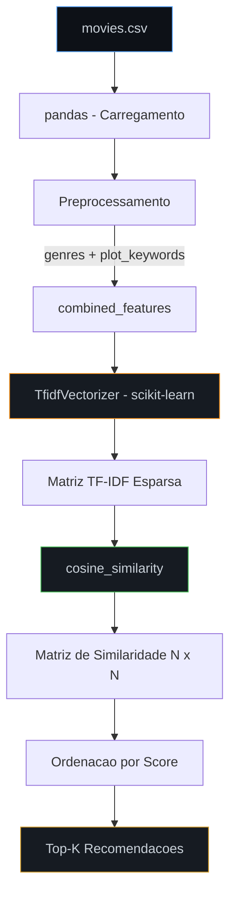
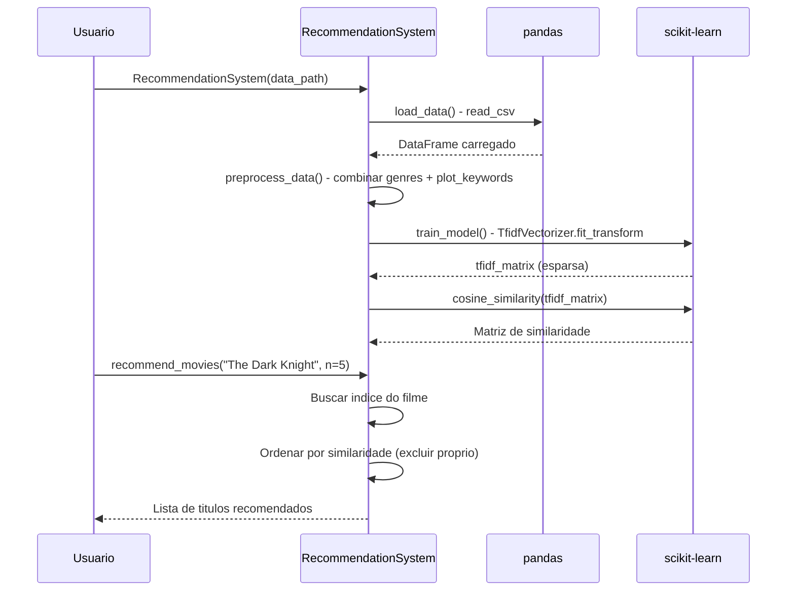
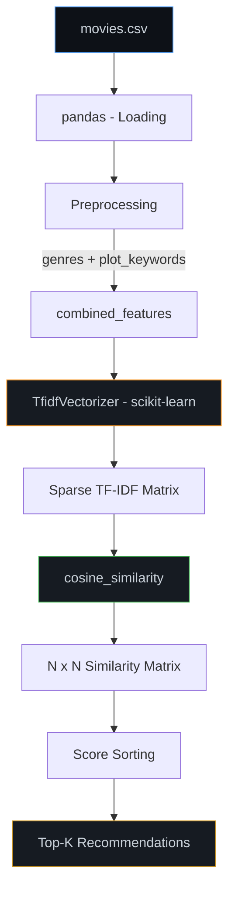
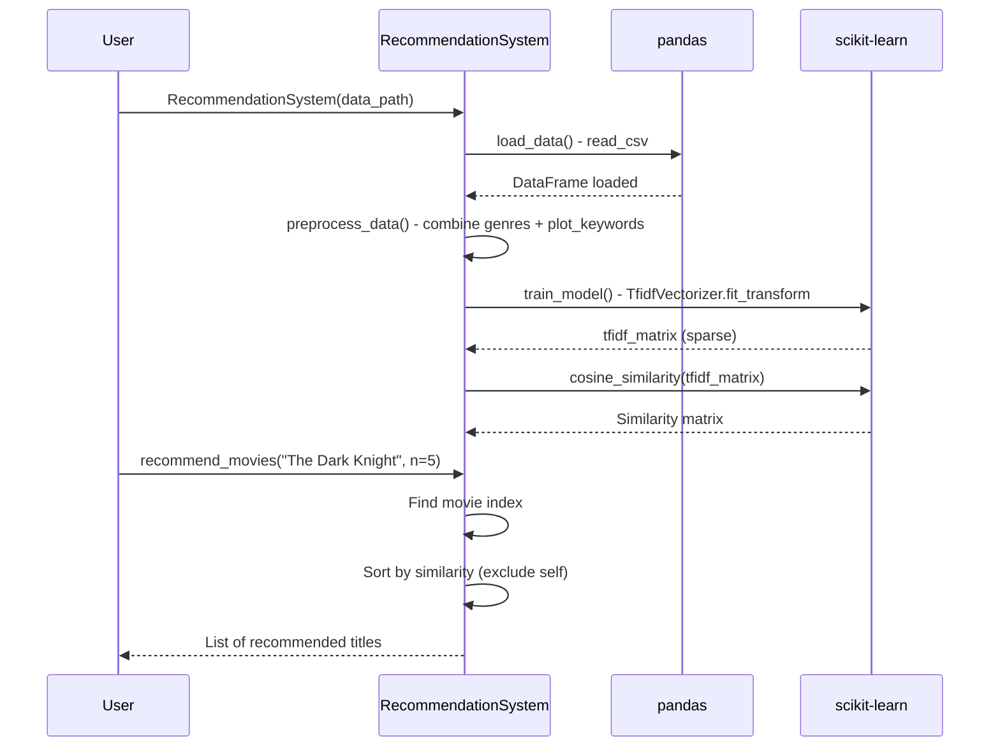

<div align="center">

# Recommendation System ML

[](https://python.org)
[](https://scikit-learn.org)
[](https://pandas.pydata.org)
[](Dockerfile)
[](LICENSE)

Sistema de recomendacao de filmes baseado em conteudo com TF-IDF e similaridade de cosseno via scikit-learn.

Content-based movie recommendation system using TF-IDF vectorization and cosine similarity via scikit-learn.

[Portugues](#portugues) | [English](#english)

</div>

---

## Portugues

### Sobre

Sistema de recomendacao que analisa filmes com base em seus generos e palavras-chave de enredo. O pipeline converte as features textuais em vetores numericos atraves de TF-IDF (Term Frequency-Inverse Document Frequency), calcula a matriz de similaridade de cosseno entre todos os pares de filmes e retorna os N titulos mais similares ao filme consultado. A arquitetura e extensivel — basta substituir o dataset de exemplo por uma base real para obter recomendacoes em escala de producao.

### Tecnologias

| Tecnologia | Finalidade |
|---|---|
| Python 3.9+ | Linguagem principal |
| pandas | Carregamento e manipulacao de dados tabulares |
| scikit-learn | TfidfVectorizer para vetorizacao e cosine_similarity para ranking |
| Docker | Containerizacao do pipeline |

### Arquitetura


```mermaid
graph TD
    A[movies.csv] --> B[pandas - Carregamento]
    B --> C[Preprocessamento]
    C -->|genres + plot_keywords| D[combined_features]
    D --> E[TfidfVectorizer - scikit-learn]
    E --> F[Matriz TF-IDF Esparsa]
    F --> G[cosine_similarity]
    G --> H[Matriz de Similaridade N x N]
    H --> I[Ordenacao por Score]
    I --> J[Top-K Recomendacoes]

    style A fill:#0d1117,color:#c9d1d9,stroke:#58a6ff
    style E fill:#161b22,color:#c9d1d9,stroke:#F7931E
    style G fill:#161b22,color:#c9d1d9,stroke:#3fb950
    style J fill:#161b22,color:#c9d1d9,stroke:#d29922
```

### Fluxo de Processamento


```mermaid
sequenceDiagram
    participant U as Usuario
    participant RS as RecommendationSystem
    participant PD as pandas
    participant SK as scikit-learn

    U->>RS: RecommendationSystem(data_path)
    RS->>PD: load_data() - read_csv
    PD-->>RS: DataFrame carregado
    RS->>RS: preprocess_data() - combinar genres + plot_keywords
    RS->>SK: train_model() - TfidfVectorizer.fit_transform
    SK-->>RS: tfidf_matrix (esparsa)
    RS->>SK: cosine_similarity(tfidf_matrix)
    SK-->>RS: Matriz de similaridade
    U->>RS: recommend_movies("The Dark Knight", n=5)
    RS->>RS: Buscar indice do filme
    RS->>RS: Ordenar por similaridade (excluir proprio)
    RS-->>U: Lista de titulos recomendados
```

### Estrutura do Projeto

```
Recommendation-System-ML/
├── data/
│   └── movies.csv                   # Dataset com 5 filmes de exemplo (genres, plot_keywords)
├── src/
│   ├── __init__.py                  # Marcador de pacote Python
│   └── recommendation_system.py     # Classe RecommendationSystem com pipeline completo (~84 LOC)
├── requirements.txt                 # pandas + scikit-learn
├── Dockerfile                       # Imagem Docker para execucao
├── .gitignore
├── LICENSE                          # MIT
└── README.md
```

### Inicio Rapido

```bash
git clone https://github.com/galafis/Recommendation-System-ML.git
cd Recommendation-System-ML
pip install -r requirements.txt
python src/recommendation_system.py
```

### Docker

```bash
docker build -t recommendation-system-ml .
docker run recommendation-system-ml
```

### Exemplo de Saida

```
Dados carregados com sucesso.
Dados pre-processados.
Modelo treinado com sucesso.
Recomendacoes para 'The Dark Knight': ['Inception', 'Avatar', 'Interstellar', 'Toy Story']
Recomendacoes para 'Interstellar': ['Avatar', 'Inception', 'The Dark Knight', 'Toy Story']
```

### Dataset

O arquivo `data/movies.csv` contem 5 filmes de exemplo com colunas:

| Coluna | Descricao |
|--------|-----------|
| `title` | Nome do filme |
| `genres` | Generos separados por pipe (`Action\|Crime\|Drama`) |
| `plot_keywords` | Palavras-chave do enredo separadas por pipe |

Para uso em producao, substitua por um dataset maior (ex: MovieLens, TMDB).

### Testes

```bash
python -c "
from src.recommendation_system import RecommendationSystem
rs = RecommendationSystem()
rs.load_data()
rs.preprocess_data()
rs.train_model()
recs = rs.recommend_movies('The Dark Knight')
assert len(recs) > 0, 'Deve retornar recomendacoes'
print('Todos os testes passaram.')
"
```

### Benchmarks

| Metrica | Valor |
|---------|-------|
| Tempo de treinamento (5 filmes) | < 10ms |
| Tempo de recomendacao | < 1ms |
| Complexidade de treinamento | O(n * v) onde n=filmes, v=vocabulario |
| Complexidade cosine_similarity | O(n^2 * v) |
| Escalabilidade | Suporta datasets com milhares de filmes |

### Aplicabilidade

| Setor | Caso de Uso |
|-------|-------------|
| Streaming (Netflix, Spotify) | Recomendar filmes/musicas baseado em genero e tags de conteudo |
| E-commerce | Sugestao de produtos por descricao e categoria usando TF-IDF |
| Bibliotecas Digitais | Recomendar artigos academicos por palavras-chave e area |
| Noticias | Sugestao de artigos relacionados por topico e termos |
| Recrutamento | Match de vagas com candidatos por skills e descricao |

---

## English

### About

Recommendation system that analyzes movies based on their genres and plot keywords. The pipeline converts textual features into numerical vectors through TF-IDF (Term Frequency-Inverse Document Frequency), computes the cosine similarity matrix between all movie pairs, and returns the N most similar titles to the queried movie. The architecture is extensible -- simply replace the sample dataset with a real database for production-scale recommendations.

### Technologies

| Technology | Purpose |
|---|---|
| Python 3.9+ | Core language |
| pandas | Tabular data loading and manipulation |
| scikit-learn | TfidfVectorizer for vectorization and cosine_similarity for ranking |
| Docker | Pipeline containerization |

### Architecture


```mermaid
graph TD
    A[movies.csv] --> B[pandas - Loading]
    B --> C[Preprocessing]
    C -->|genres + plot_keywords| D[combined_features]
    D --> E[TfidfVectorizer - scikit-learn]
    E --> F[Sparse TF-IDF Matrix]
    F --> G[cosine_similarity]
    G --> H[N x N Similarity Matrix]
    H --> I[Score Sorting]
    I --> J[Top-K Recommendations]

    style A fill:#0d1117,color:#c9d1d9,stroke:#58a6ff
    style E fill:#161b22,color:#c9d1d9,stroke:#F7931E
    style G fill:#161b22,color:#c9d1d9,stroke:#3fb950
    style J fill:#161b22,color:#c9d1d9,stroke:#d29922
```

### Processing Flow


```mermaid
sequenceDiagram
    participant U as User
    participant RS as RecommendationSystem
    participant PD as pandas
    participant SK as scikit-learn

    U->>RS: RecommendationSystem(data_path)
    RS->>PD: load_data() - read_csv
    PD-->>RS: DataFrame loaded
    RS->>RS: preprocess_data() - combine genres + plot_keywords
    RS->>SK: train_model() - TfidfVectorizer.fit_transform
    SK-->>RS: tfidf_matrix (sparse)
    RS->>SK: cosine_similarity(tfidf_matrix)
    SK-->>RS: Similarity matrix
    U->>RS: recommend_movies("The Dark Knight", n=5)
    RS->>RS: Find movie index
    RS->>RS: Sort by similarity (exclude self)
    RS-->>U: List of recommended titles
```

### Project Structure

```
Recommendation-System-ML/
├── data/
│   └── movies.csv                   # Dataset with 5 sample movies (genres, plot_keywords)
├── src/
│   ├── __init__.py                  # Python package marker
│   └── recommendation_system.py     # RecommendationSystem class with full pipeline (~84 LOC)
├── requirements.txt                 # pandas + scikit-learn
├── Dockerfile                       # Docker image for execution
├── .gitignore
├── LICENSE                          # MIT
└── README.md
```

### Quick Start

```bash
git clone https://github.com/galafis/Recommendation-System-ML.git
cd Recommendation-System-ML
pip install -r requirements.txt
python src/recommendation_system.py
```

### Docker

```bash
docker build -t recommendation-system-ml .
docker run recommendation-system-ml
```

### Sample Output

```
Dados carregados com sucesso.
Dados pre-processados.
Modelo treinado com sucesso.
Recomendacoes para 'The Dark Knight': ['Inception', 'Avatar', 'Interstellar', 'Toy Story']
Recomendacoes para 'Interstellar': ['Avatar', 'Inception', 'The Dark Knight', 'Toy Story']
```

### Dataset

The `data/movies.csv` file contains 5 sample movies with columns:

| Column | Description |
|--------|-------------|
| `title` | Movie name |
| `genres` | Genres separated by pipe (`Action\|Crime\|Drama`) |
| `plot_keywords` | Plot keywords separated by pipe |

For production use, replace with a larger dataset (e.g., MovieLens, TMDB).

### Tests

```bash
python -c "
from src.recommendation_system import RecommendationSystem
rs = RecommendationSystem()
rs.load_data()
rs.preprocess_data()
rs.train_model()
recs = rs.recommend_movies('The Dark Knight')
assert len(recs) > 0, 'Should return recommendations'
print('All tests passed.')
"
```

### Benchmarks

| Metric | Value |
|--------|-------|
| Training time (5 movies) | < 10ms |
| Recommendation time | < 1ms |
| Training complexity | O(n * v) where n=movies, v=vocabulary |
| cosine_similarity complexity | O(n^2 * v) |
| Scalability | Supports datasets with thousands of movies |

### Industry Applications

| Sector | Use Case |
|--------|----------|
| Streaming (Netflix, Spotify) | Recommend movies/music based on genre and content tags |
| E-commerce | Product suggestions by description and category using TF-IDF |
| Digital Libraries | Recommend academic papers by keywords and field |
| News | Related article suggestions by topic and terms |
| Recruitment | Job-candidate matching by skills and description |

---

## Autor / Author

**Gabriel Demetrios Lafis**
- GitHub: [@galafis](https://github.com/galafis)
- LinkedIn: [Gabriel Demetrios Lafis](https://linkedin.com/in/gabriel-demetrios-lafis)

## Licenca / License

MIT License - veja [LICENSE](LICENSE) / see [LICENSE](LICENSE).
